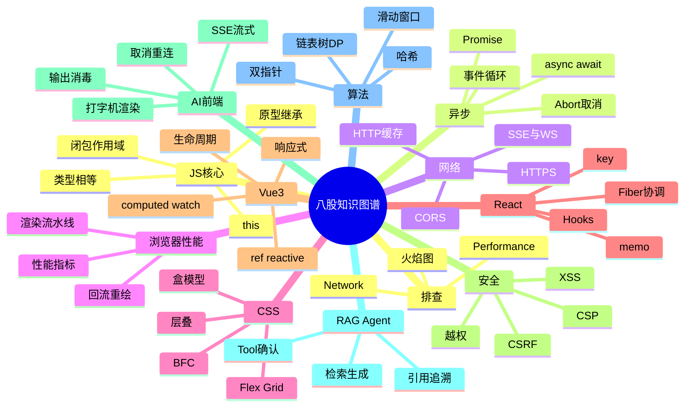

# 八股知识图谱 · 怎么用

记不住往往不是题太少，而是**概念没有挂在关系网上**。这张图谱把题库收成三层：

**主题域 → 高频概念 → 题库卡片**

## 打开方式

目录：`八股预备/知识图谱/`（开源仓库里同名目录也有）

1. 双击 `打开知识图谱.bat`  
   或手动：

```bash
cd 知识图谱
python build_graph.py
python -m http.server 8766
```

2. 浏览器打开：<http://127.0.0.1:8766/>

> 需要能访问 unpkg（加载 vis-network）。改完题库后重新跑一次 `build_graph.py` 再刷新。

## 怎么背（建议）

1. **每天只走左侧一条「记忆闭环」**（浏览器一圈 / Vue 响应式一圈 / AI 对话一圈…）。
2. 看概念之间的边：`先掌握` / `相关` / `对比` —— 面试追问通常顺着这些边出来。
3. 右侧「题库卡片」路径，用 Typora 打开原题细背。
4. 需要时再勾选「显示题目叶子」，不建议一上来全开（会花）。

## 和背诵本的关系

| 工具 | 作用 |
|------|------|
| 背诵本 | 单题过背、掌握度 |
| 知识图谱 | 看结构、串追问、找薄弱域 |
| Typora题库 | 改内容的源头 |

## 文件

- `graph.base.json`：人工整理的域 / 概念 / 关系骨架
- `graph.json`：骨架 + 自动挂接的题卡（`build_graph.py` 生成）
- `index.html`：可视化页面
- `build_graph.py`：刷新挂接
- `打开知识图谱.bat`：一键启动

## Typora 总览（可预览）


